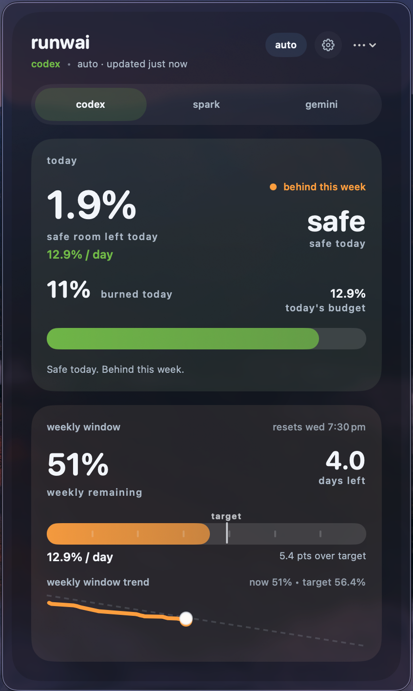

# runwai

runwai is a tiny macOS menu bar app for codex, spark, and gemini usage runway.

It answers three things fast:

- can i keep working today?
- when should i stop?
- how much runway is left this week?



## current build

- codex and codex spark auto-refresh from your local Codex login
- gemini auto-refresh from local Gemini CLI
- daily pacing first, weekly runway second
- local-only data

## install

- download the latest zip from GitHub Releases
- unzip it
- drag `runwai.app` into `/Applications`
- launch it

## local dev

```bash
xcodegen generate
xcodebuild -project runwai.xcodeproj -scheme Runwai -destination "platform=macOS" build
xcodebuild -project runwai.xcodeproj -scheme Runwai -destination "platform=macOS" test
open runwai.xcodeproj
```
